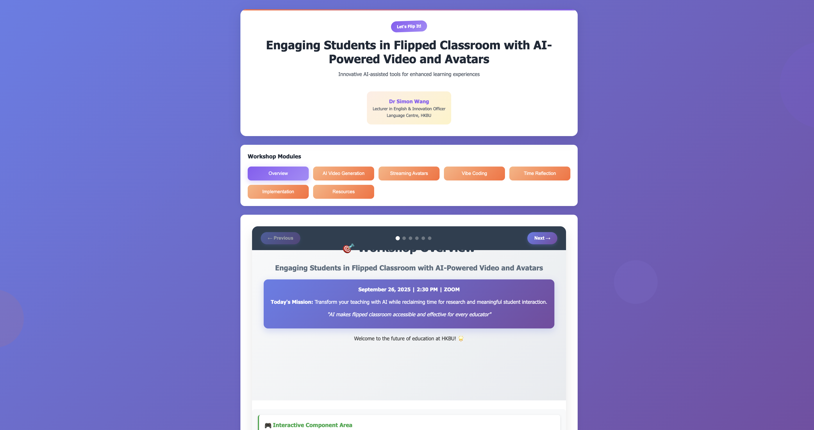

/Users/simonwang/Documents/Usage/VibeCodingMac/DailyAssistant/projects/AItutor/Outreach/presentationWorkhop/index.html

/Users/simonwang/Documents/Usage/VibeCodingMac/DailyAssistant/projects/AItutor/Outreach/presentationWorkhop/presentations

I prepare some notes to prepare slides above

but the slides should be relatively simple -just a few bullet points

currently there are too many tabs

I want sth simpler - first overview and introduction - here I talk about the flipped classroom approach

then I focus on video generation - discuss the HeyGen approach first; then explore the difference between GUI and API -

After video generation: I talk about avatar interaction

here I explain the difference between text-based customised chatbot and multimodal avatar

after discussing the vendor solutions- we start exploring the in-house solutions through vibe coding (challenges facing non-experts and new models of collaboration)

so we should revise the overall structure of /Users/simonwang/Documents/Usage/VibeCodingMac/DailyAssistant/projects/AItutor/Outreach/presentationWorkhop/components and index.html

but first let's have a plan

* **Slide 1:** Flipped classroom foundations
* **Slide 2:** HeyGen vs API approaches for video generation
* **Slide 3:** Text-based vs multimodal avatar interaction
* **Slide 4:** VibeCoding for non-experts and collaboration

it should be 4 tabs: each tab with one component - so we need to update /Users/simonwang/Documents/Usage/VibeCodingMac/DailyAssistant/projects/AItutor/Outreach/presentationWorkhop/components

we also need tab 5: Future collaboration roadmap (revise the wording a bit) 

yes this structure is simpler and better 

let's set up the overall page in index first 

slides content can be updated later 

demo can placeholders for now 

======feedback on the latest version =========

the font size too small

the layout too messy

I just want a simple slide presentation

under which there is some demo

Let's revise this a bit

the current set up is too narrow - which should make it wider

the slides are not working very well

the navigation bar at the top blocks part of the slides

============

Let's review the current codebase a bit
I'd like to focus more on the content first

so I'd like to look at an outline of my presentation

I'll use vibe coding to create more interactive materials

but for overview

I was reading some review articles on flipped classroom as well as my 2017 letter to the editor on lifting attendance requirement

https://www.scmp.com/comment/letters/article/2109347/relaxed-attendance-rules-hong-kongs-baptist-university-will-improve

in terms of completing this project which is to prepare the talk /Users/simonwang/Documents/Usage/VibeCoding/DailyAssistant/projects/AItutor/Outreach/presentationWorkhop/docs/poster.jpg

I need to first decide what to cover in the talk

also I want to take the opportunity to invite more colleagues to join

when we decide the content - we should ask

- what are the key messages and arguments
- how can we demonstrate the potential of the tech
- what is the roadmap for developing a solid and practical solutions

===========update notes below ==============

## Presentation Outline: Engaging Students in Flipped Classroom with AI-Powered Video and Avatars

### **Core Themes & Key Messages**

#### 1. **Educational Innovation Through Technology**

- **Message**: AI-powered tools can transform traditional lecture-based teaching into engaging, interactive learning experiences
- **Evidence**: Reference to 2017 SCMP letter on lifting attendance requirements - technology enables flexible, quality learning

#### 2. **Practical Implementation of Flipped Classroom**

- **Message**: Flipped classroom model addresses real pedagogical challenges while improving student engagement
- **Support**: Review of current literature on flipped classroom effectiveness

#### 3. **AI as Educational Enhancement Tool**

- **Message**: AI avatars and video generation democratize content creation for educators
- **Demonstration**: Live showcase of VibeCoding tools and avatar generation

---

### **Workshop Structure (90 minutes)**

#### **Module 1: Overview & Context (15 minutes)**

**Key Questions:**

- Why flip the classroom? What are the pedagogical benefits?
- How does AI enhance rather than replace human teaching?
- What is the current state of educational technology adoption?

#### **Module 2: AI Video Generation (20 minutes)**

**Demonstration Focus:**

- Live creation of educational content using AI
- Show script-to-video pipeline
- Demonstrate editing and customization capabilities

#### **Module 3: Streaming Avatars (15 minutes)**

**Interactive Element:**

- Real-time avatar interaction
- Demonstrate conversational AI capabilities
- Show potential for personalized tutoring

#### **Module 4: VibeCoding Platform (20 minutes)**

**Hands-on Experience:**

- Participants create their own content
- Guided walkthrough of platform features
- Collaborative content development

#### **Module 5: Time for Reflection & Q&A (10 minutes)**

**Discussion Points:**

- Challenges and concerns about AI in education
- Implementation strategies for different contexts
- Resource requirements and support needs

#### **Module 6: Implementation Roadmap (10 minutes)**

**Practical Next Steps:**

- How to start small and scale up
- Resource allocation and planning
- Building institutional support and colleague buy-in

---

### **Technology Demonstration Elements**

1. **Script-to-Video Generation**

   - From text input to professional video output
   - Multiple voice options and styles
   - Automated slide synchronization
2. **Interactive Avatar Conversations**

   - Real-time Q&A with AI tutors
   - Adaptive responses based on student needs
   - 24/7 availability for student support
3. **Content Customization**

   - Rapid adaptation for different audiences
   - Multi-language support possibilities
   - Accessibility features integration

---

### **Implementation Roadmap**

**Phase 1: Foundation Building (Months 1-2)**

- Identify pilot course or module
- Basic training for interested faculty
- Small-scale content creation experiments

**Phase 2: Expansion & Refinement (Months 3-6)**

- Scale to additional courses
- Develop best practices documentation
- Build internal expertise and support network

**Phase 3: Integration & Innovation (Months 6-12)**

- Full curriculum integration
- Advanced feature utilization
- Research and effectiveness measurement

---

### **Colleague Engagement Strategy**

- Emphasize practical benefits over technical complexity
- Show concrete examples of student engagement improvement
- Address common concerns about AI replacing human connection
- Highlight time-saving and efficiency benefits
- Mentorship program for early adopters
- Regular sharing sessions and best practice workshops

---

### **Expected Outcomes**

**Immediate:** Understanding of flipped classroom principles, hands-on AI tool experience, clear implementation plan

**Short-term:** Pilot implementations, feedback cycles, growing community of practice

**Long-term:** Measurable engagement improvement, broader adoption, research outputs

But I actually need an outline in this note here for further editing

## 📋 REVISED PLAN: Simple Slide Presentation

### **Problem Analysis:**

- Current setup: too many tabs, small fonts, messy layout
- Need: Simple slide presentation with clean demos underneath
- Goal: Professional, easy-to-follow workshop structure

### **New Structure (4 Main Slides):**

#### **Slide 1: Overview & Introduction (15 min)**

- **Content:** Flipped classroom approach
- **Bullet Points:**
  - Traditional vs. Flipped Classroom
  - Benefits of student-centered learning
  - Role of technology in modern education
- **Demo Area:** Quick poll or interactive Q&A

#### **Slide 2: Video Generation (25 min)**

- **Content:** AI-powered video creation
- **Bullet Points:**
  - HeyGen approach (GUI-based)
  - API-based solutions
  - Pros/cons of each approach
  - Cost and scalability considerations
- **Demo Area:** Live video generation demo

#### **Slide 3: Avatar Interaction (25 min)**

- **Content:** From chatbots to multimodal avatars
- **Bullet Points:**
  - Text-based vs. multimodal interaction
  - Customized chatbot capabilities
  - Avatar personality and voice options
  - Real-time interaction possibilities
- **Demo Area:** Live avatar conversation

#### **Slide 4: VibeCoding & In-House Solutions (25 min)**

- **Content:** Empowering non-experts
- **Bullet Points:**
  - Challenges for non-technical educators
  - Collaborative development models
  - Building institutional capacity
  - Sustainable implementation strategies
- **Demo Area:** Hands-on VibeCoding session

### **Design Requirements:**

1. **Large, readable fonts** (minimum 24px for body text)
2. **Clean, minimal layout** (max 4-5 bullet points per slide)
3. **Simple navigation** (Previous/Next buttons only)
4. **Demo integration** (expandable demo areas below each slide)
5. **Professional appearance** (consistent colors, spacing)

### **Technical Implementation Plan:**

#### **Phase 1: Restructure Components**

- Simplify to 4 main components only
- Remove complex navigation tabs
- Implement slide-style layout

#### **Phase 2: Improve Visual Design**

- Increase font sizes significantly
- Clean up spacing and alignment
- Add slide numbers and progress indicators

#### **Phase 3: Integrate Demos**

- Embed demo iframes or components
- Add show/hide functionality for demos
- Ensure demos don't interfere with slides

#### **Phase 4: Test & Refine**

- Test on different screen sizes
- Ensure smooth transitions
- Optimize for presentation mode

### **Success Criteria:**

- ✅ Clean, professional slide appearance
- ✅ Easy navigation (forward/back only)
- ✅ Large, readable text from distance
- ✅ Seamless demo integration
- ✅ Works well on projector/large screen
