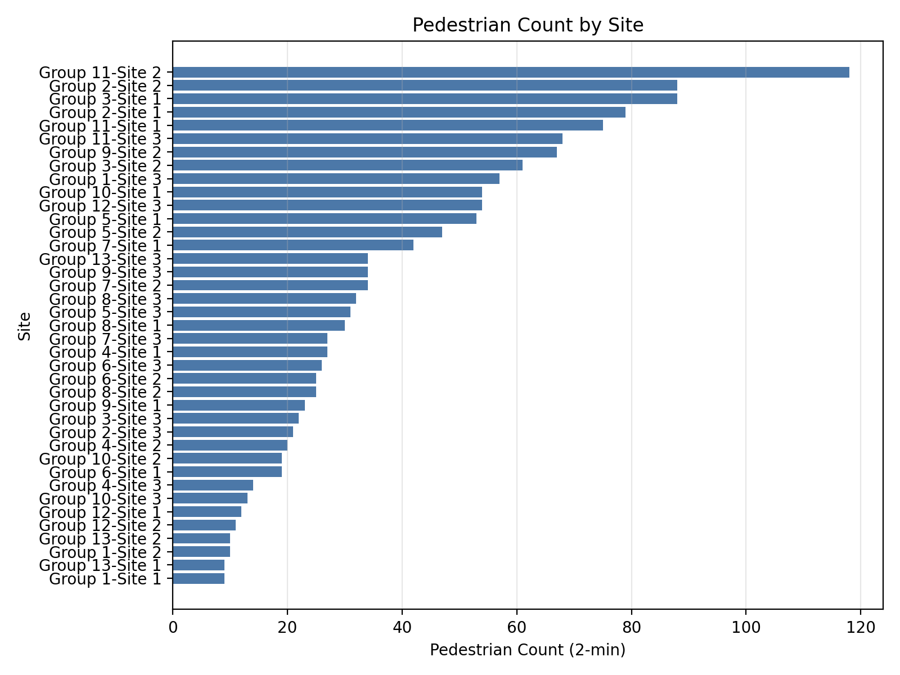

# Donald — Next steps for your Geography coursework visuals

Hi Donald, here’s a quick update and what I need from you so we can lock the exact charts for your project.

## What’s done
- Cleaned your Excel data into two tidy files for charting:
  - `cleaned/cleaned_wide.csv` (one row per site with key numbers)
  - `cleaned/cleaned_long.csv` (flexible format for other views)
- Made two demo charts linked to your hypotheses (with simple trendlines):
  1) Noise vs Distance from Victoria Harbour
  2) EQS vs Distance from Victoria Harbour

### Demo charts
- Noise vs Distance (m) → trendline included

  
  
  _Figure 1. Noise (dB) vs Distance (m); scatter with linear trendline._

- EQS vs Distance (m) → trendline included

  
  
  _Figure 2. EQS vs Distance (m); scatter with linear trendline._

### More demo charts (to help you choose)
- Traffic vs Distance (m)

  
  
  _Figure 3. Total traffic (2-min) vs Distance (m); scatter with linear trendline._

- Pedestrians vs Distance (m)

  
  
  _Figure 4. Pedestrian count (2-min) vs Distance (m); scatter with linear trendline._

- Building Height vs EQS

  
  
  _Figure 5. Building height (m) vs EQS; scatter with linear trendline._

- Pedestrian Count by Site (horizontal bar)

  
  
  _Figure 6. Pedestrian count by Group–Site; horizontal bar chart._

- Correlation Heatmap (numeric variables)

  
  
  _Figure 7. Correlation heatmap across numeric variables (−1 to +1)._ 

## Your draft — research question and hypotheses (verbatim)
> Research Question: "How do the Urban Characteristics change with distance from Victoria Harbour?"

> Hypotheses:
> 1) Noise level will decrease with distance from the CBD.
> 2) EQS will decrease with distance from the CBD.
> 3) Amount of transport options will decrease with the distance from the CBD.

If you want to adjust wording (e.g., use “Victoria Harbour” consistently instead of “CBD”), reply with the exact sentences to use.

## Choose your charts (tell me exactly what you want)
For each hypothesis, pick 1 primary chart and (optionally) 1 supporting chart. I’ll label, caption, and number them per your guide (HowtoA.md).

- Hypothesis 1 (Noise vs Distance)
  - Primary (recommended): Scatter of Noise (dB) vs Distance (m) with linear trendline — DEMO provided
  - Supporting options:
    - Noise vs Total Traffic (if you want to show a mechanism)
    - Noise by Site (simple bar, grouped by Group/Site)

- Hypothesis 2 (EQS vs Distance)
  - Primary (recommended): Scatter of EQS vs Distance with linear trendline — DEMO provided
  - Supporting options:
    - Building height (m) vs EQS (possible link between urban form and quality)
    - EQS vs Noise (do higher-noise places score lower?)

- Hypothesis 3 (Transport vs Distance)
  - What we have now: `traffic_total` (2-minute total) and `pedestrian_count`. If you also have a count of “transport options” (e.g., number of modes or lines), send it and I’ll add that chart.
  - Primary (current data): Scatter of Total Traffic vs Distance (trendline)
  - Supporting options:
    - Pedestrian Count vs Distance (trendline)
    - Bar: Traffic Total by Site (ranked)
    - If vehicle breakdown appears later: Stacked bar by vehicle type (Car/Taxi/Truck/Motorbike/Van)

## Presentation details (preferences — reply with your choices)
- Labels: Show Group and Site names on points? (Yes/No)
- Trendlines: Keep simple linear fits? (Yes/No)
- Style: Any colour preferences or school template to match?
- Captions: Short, factual captions under each figure (Yes/No)
- File format: PNG is default; do you also want PDF for print?

## What I’ll deliver after your reply
- Final figure set (PNG) with figure numbers, clear titles, axis labels, and legible fonts.
- Short, coursework-ready captions and a few bullet notes to support your “Describe → Explain → Anomalies → Link to theory” analysis flow.

## Anything to correct or add?
- If any distances, EQS, or counts look off, mark them and I’ll update the cleaned data and redo the charts.
- If you’ve got exact counts of “transport options,” I’ll replace the proxy (traffic total) with the real variable.

Thanks! Once you confirm chart choices and any edits to the hypotheses, I’ll produce the final visuals the same day.
