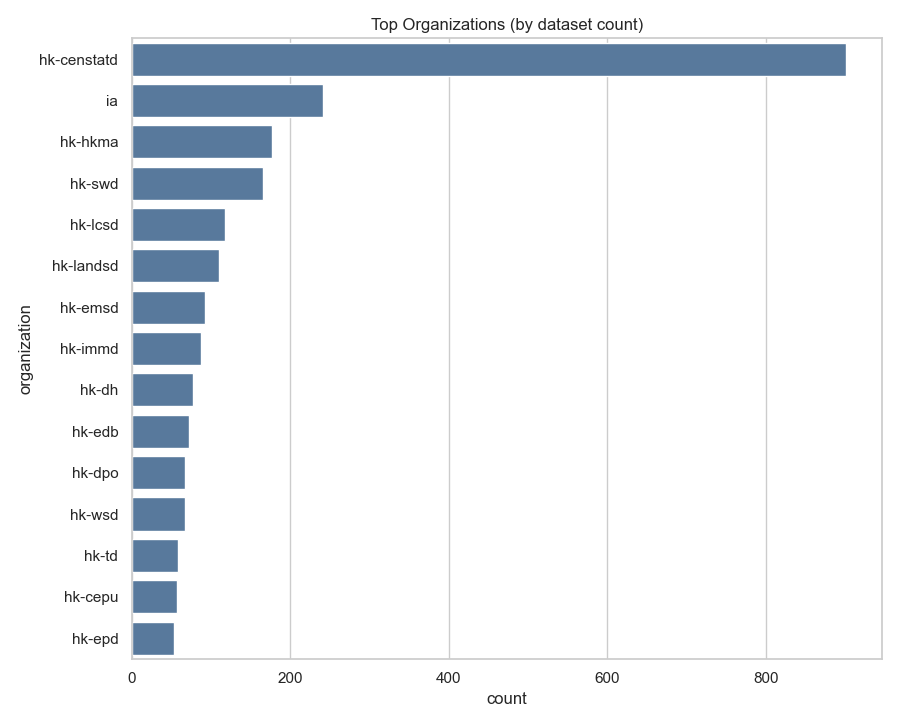
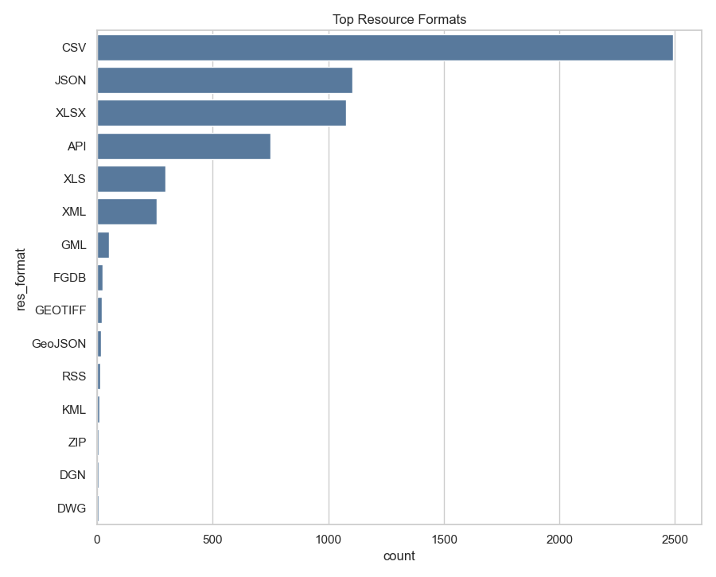
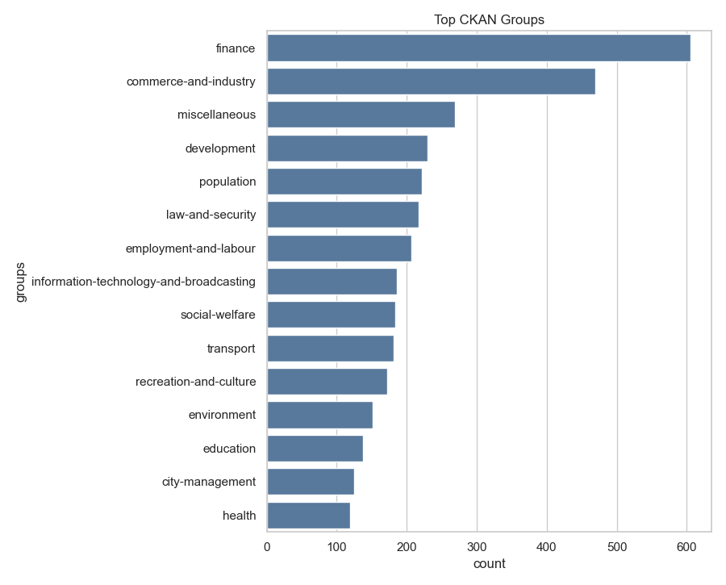

# data.gov.hk Catalog Overview

Total datasets indexed: 3651

## Executive summary

- Most active organizations: hk-censtatd (901), ia (241), hk-hkma (177), hk-swd (166), hk-lcsd (118)
- Most common formats: CSV (2491), JSON (1106), XLSX (1077), API (751), XLS (296)
- Top groups: finance (605), commerce-and-industry (469), miscellaneous (269), development (230), population (222)
- Top tags: 
- Licenses: 

## Visuals

### Top organizations

### Top resource formats

### Top CKAN groups

