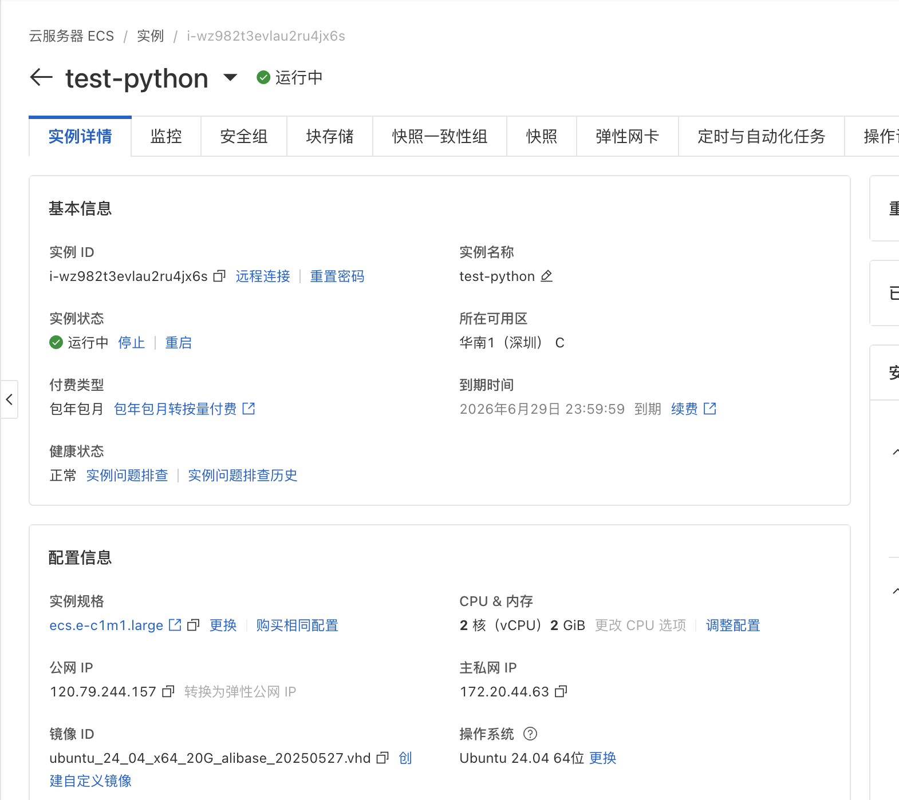
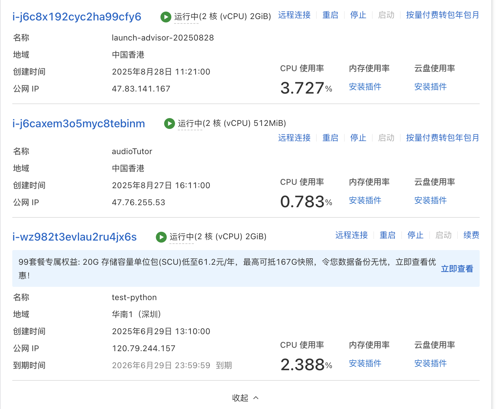
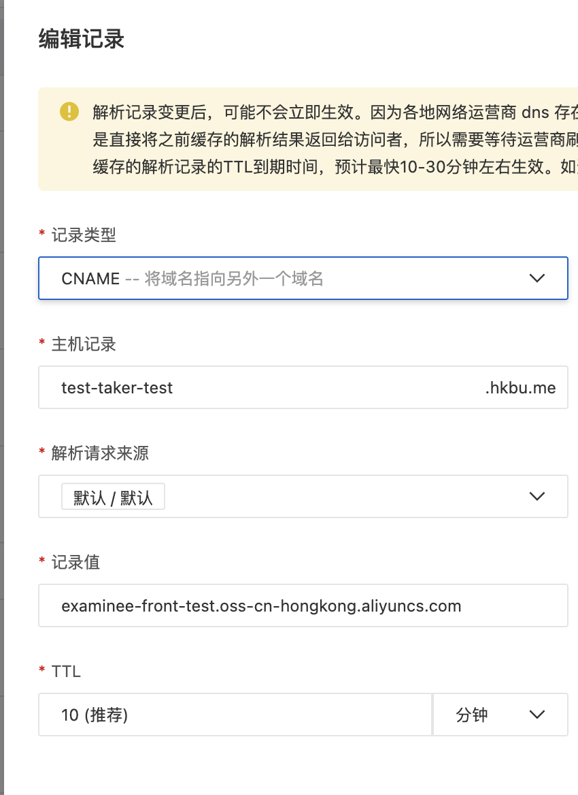

# 阿里云服务器访问信息

## 连接信息

- **公网IP:** 120.79.244.157
- **用户名:** root
- **密码:** rEf7NkmnWXY3UU8!

## 项目发现

- **项目路径:** `/app/ExamPlatform-BE`
- **技术栈:** FastAPI (Python)
- **启动脚本:** `exam-platform.sh`
- **虚拟环境:** venv
- **运行端口:** 80

## exam-platform.sh 脚本内容：

```bash
#!/bin/bash
cd /app/ExamPlatform-BE
source venv/bin/activate
export ENV_STATE=test
nohup fastapi run --host=0.0.0.0 --port=80 &
exit 0
```

## SSH会话记录：

```
root@iZwz982t3evlau2ru4jx6sZ:~# pwd
/root

root@iZwz982t3evlau2ru4jx6sZ:~# whoami  
root

root@iZwz982t3evlau2ru4jx6sZ:~# ls -la
total 88
drwx------  7 root root  4096 Aug 20 22:44 .
drwxr-xr-x 24 root root  4096 Jun 29 14:25 ..
-rw-------  1 root root 10362 Aug 20 22:56 .bash_history
-rw-r--r--  1 root root  3106 Apr 22  2024 .bashrc
-rwxr-xr-x  1 root root    63 Jul  1 16:21 be.sh
drwx------  3 root root  4096 Jun 29 14:39 .cache
drwx------  4 root root  4096 Jun 29 16:47 .config
-rwxr-xr-x  1 root root   137 Jul  5 17:54 exam-platform.sh
-rw-r--r--  1 root root    29 Jun 29 15:07 .gitconfig
-rw-------  1 root root    58 Aug 19 23:36 .git-credentials
-rw-------  1 root root    20 Jul 24 20:39 .lesshst
drwxr-xr-x  4 root root  4096 Jun 29 16:33 .npm
drwxr-xr-x  2 root root  4096 May 27 11:25 .pip
-rw-r--r--  1 root root   161 Apr 22  2024 .profile
-rw-r--r--  1 root root    72 May 27 11:25 .pydistutils.cfg
drwx------  2 root root  4096 May 27 11:15 .ssh
-rw-------  1 root root 12384 Aug 20 22:44 .viminfo

root@iZwz982t3evlau2ru4jx6sZ:~# cat exam-platform.sh
#!/bin/bash
cd /app/ExamPlatform-BE
source venv/bin/activate
export ENV_STATE=test
nohup fastapi run --host=0.0.0.0 --port=80 &
exit 0

root@iZwz982t3evlau2ru4jx6sZ:~# find /root -name ".git" -type d 2>/dev/null
(无结果 - Git仓库不在/root目录)

root@iZwz982t3evlau2ru4jx6sZ:~# cat .gitconfig
[credential]
        helper = store

root@iZwz982t3evlau2ru4jx6sZ:~# ls -la /var/www/
total 12
drwxr-xr-x  3 root root 4096 Jul  9 00:24 .
drwxr-xr-x 14 root root 4096 Jul  9 00:24 ..
drwxr-xr-x  2 root root 4096 Jul  9 00:24 html
```

```
root@iZwz982t3evlau2ru4jx6sZ:~# cat exam-platform.sh
#!/bin/bash

cd /app/ExamPlatform-BE
source venv/bin/activate
export ENV_STATE=test
nohup fastapi run --host=0.0.0.0 --port=80 &

exit 0
root@iZwz982t3evlau2ru4jx6sZ:~# find /root -name ".git" -type d 2>/dev/null
root@iZwz982t3evlau2ru4jx6sZ:~# cat .gitconfig
[credential]
        helper = store
root@iZwz982t3evlau2ru4jx6sZ:~# ls -la /var/www/
total 12
drwxr-xr-x  3 root root 4096 Jul  9 00:24 .
drwxr-xr-x 14 root root 4096 Jul  9 00:24 ..
drwxr-xr-x  2 root root 4096 Jul  9 00:24 html
root@iZwz982t3evlau2ru4jx6sZ:~# 

```

rEf7NkmnWXY3UU8! 


root@iZwz982t3evlau2ru4jx6sZ:~# ^C
root@iZwz982t3evlau2ru4jx6sZ:~# pwd
whoami
ls -la
/root
root
total 88
drwx------  7 root root  4096 Aug 20 22:44 .
drwxr-xr-x 24 root root  4096 Jun 29 14:25 ..
-rw-------  1 root root 10362 Aug 20 22:56 .bash_history
-rw-r--r--  1 root root  3106 Apr 22  2024 .bashrc
-rwxr-xr-x  1 root root    63 Jul  1 16:21 be.sh
drwx------  3 root root  4096 Jun 29 14:39 .cache
drwx------  4 root root  4096 Jun 29 16:47 .config
-rwxr-xr-x  1 root root   137 Jul  5 17:54 exam-platform.sh
-rw-r--r--  1 root root    29 Jun 29 15:07 .gitconfig
-rw-------  1 root root    58 Aug 19 23:36 .git-credentials
-rw-------  1 root root    20 Jul 24 20:39 .lesshst
drwxr-xr-x  4 root root  4096 Jun 29 16:33 .npm
drwxr-xr-x  2 root root  4096 May 27 11:25 .pip
-rw-r--r--  1 root root   161 Apr 22  2024 .profile
-rw-r--r--  1 root root    72 May 27 11:25 .pydistutils.cfg
drwx------  2 root root  4096 May 27 11:15 .ssh
-rw-------  1 root root 12384 Aug 20 22:44 .viminfo






