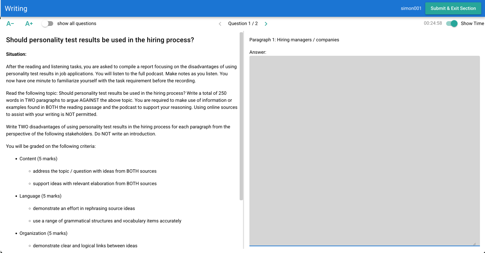
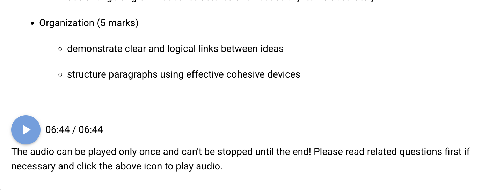
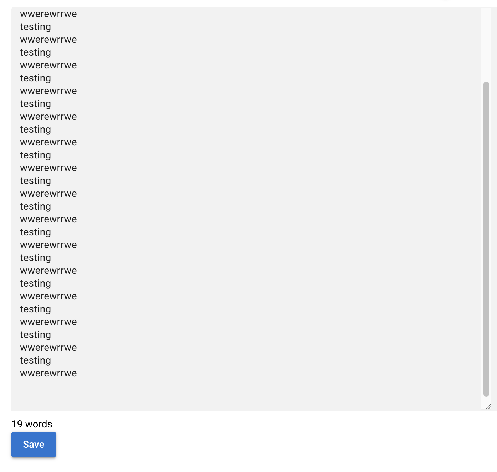
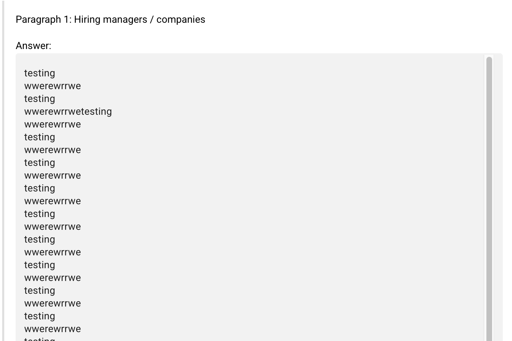

# Writing Section Review - Platform Testing Notes

**Date:** 9 September 2025  
**Tester:** simon001  
**Section:** Writing Section - Personality Test Topic  
**Test Environment:** Platform UI Testing

---

## 📝 Content Structure Issues

### Major Content Problems

#### 1. **Inconsistent Task Instructions**
- **Problem:** Two different versions of the writing prompt appear:
  - Version A: "Should personality test results be used in the hiring process?" 
  - Version B: "Personality test results should not be used in job applications"
- **Impact:** Creates confusion about the actual stance students should take
- **Recommendation:** Standardize to one clear prompt with explicit direction (argue FOR or AGAINST)

#### 2. **Missing Section Labels**
- **Current:** "Situation:" label only
- **Needed:** Add "Instructions:" label to separate contextual setup from task requirements
- **Benefit:** Clearer information hierarchy for students

#### 3. **Incomplete Audio Information**
- **Missing:** Duration of the full podcast
- **Current:** "You will listen to the full podcast" (no time specified)
- **Recommendation:** Add podcast duration (e.g., "You will listen to the 8-minute podcast")
- **Rationale:** Helps students manage their time effectively

#### 4. **Unusual Rubric Exposure**
- **Issue:** Detailed marking criteria (5+5+5 marks breakdown) visible to students during test
- **Industry Standard:** Rubrics typically kept internal for examiner use
- **Action Required:** Flag this for exam writing team (Rhett) - policy decision needed
- **Options:** 
  - Remove detailed rubric entirely
  - Provide simplified version focusing on expectations, not marks

---

## 🎨 Design & User Experience Issues

### Interface Problems Documented

#### 1. **Plain and Cluttered Instructions Page**

- **Current State:** Dense text blocks, poor visual hierarchy
- **Issues:**
  - No visual separation between different instruction types
  - Wall of text format reduces readability
  - Important elements not highlighted

#### 2. **Audio Player Placement**

- **Current:** Audio player positioned at bottom of page
- **Problem:** Not prominent enough for critical listening task
- **Recommendation:** 
  - Move to more prominent position (top-right or center)
  - Consider sticky/floating player that remains visible during scrolling
  - Add visual emphasis (border, highlighting)

#### 3. **Overall Interface Layout**

- **Current:** Instructions cramped on left side
- **Opportunity:** Use right panel for:
  - Timer display
  - Task checklist/progress
  - Key reminders
  - Audio controls

---

## 🔧 Recommended Improvements

### Content Fixes (High Priority)
1. **Standardize Writing Prompt:** Choose one version and ensure consistency
2. **Add Missing Labels:** Include "Instructions:" section header
3. **Specify Audio Duration:** Add podcast length information
4. **Review Rubric Policy:** Consult with exam team on student-facing criteria

### Design Enhancements (Medium Priority)
1. **Restructure Instructions Layout:**
   - Use clear section breaks
   - Implement visual hierarchy (headings, bullet points, spacing)
   - Highlight key requirements

2. **Improve Audio Integration:**
   - Reposition player for better visibility
   - Add progress indicator
   - Include replay functionality if permitted

3. **Optimize Page Layout:**
   - Utilize right panel for supplementary information
   - Implement responsive design elements
   - Add professional styling elements

---

## 📋 Action Items

### For Development Team:
- [ ] Fix inconsistent writing prompts
- [ ] Add section labels to instruction structure
- [ ] Include podcast duration information
- [ ] Reposition audio player interface

### For Exam Team (Rhett):
- [ ] **Policy Decision Required:** Student-facing rubrics - keep detailed version or simplify?
- [ ] Review writing prompt versions for final standardization
- [ ] Confirm audio duration specifications

### For UI/UX Team:
- [ ] Redesign instructions page layout
- [ ] Implement professional styling
- [ ] Optimize right panel usage
- [ ] Test audio player prominence

---

## 🎯 Testing Context

**Account Used:** simon001  
**Test Focus:** Writing section functionality and user experience  
**Key Finding:** Content consistency and interface design need attention before production deployment

**Screenshots Included:** 
- Figure 1: Interface layout showing cluttered instructions
- Figure 2: Additional interface view
- Figure 3: Audio player positioning issues
- Figure 4: Complete interface overview

---

## 📊 Visual Evidence Summary

The attached screenshots demonstrate:
1. **Cluttered text presentation** without proper visual hierarchy
2. **Poor audio player integration** at bottom of interface
3. **Underutilized screen real estate** with cramped left-side layout
4. **Lack of professional styling** in the overall interface design

These visual issues directly impact user experience and should be addressed before production deployment.

---

*Note: This review focuses on the writing section specifically. Similar content and design review recommended for other test sections.*
