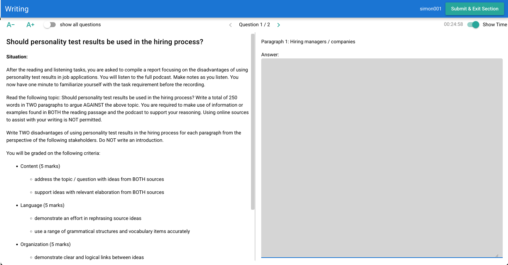
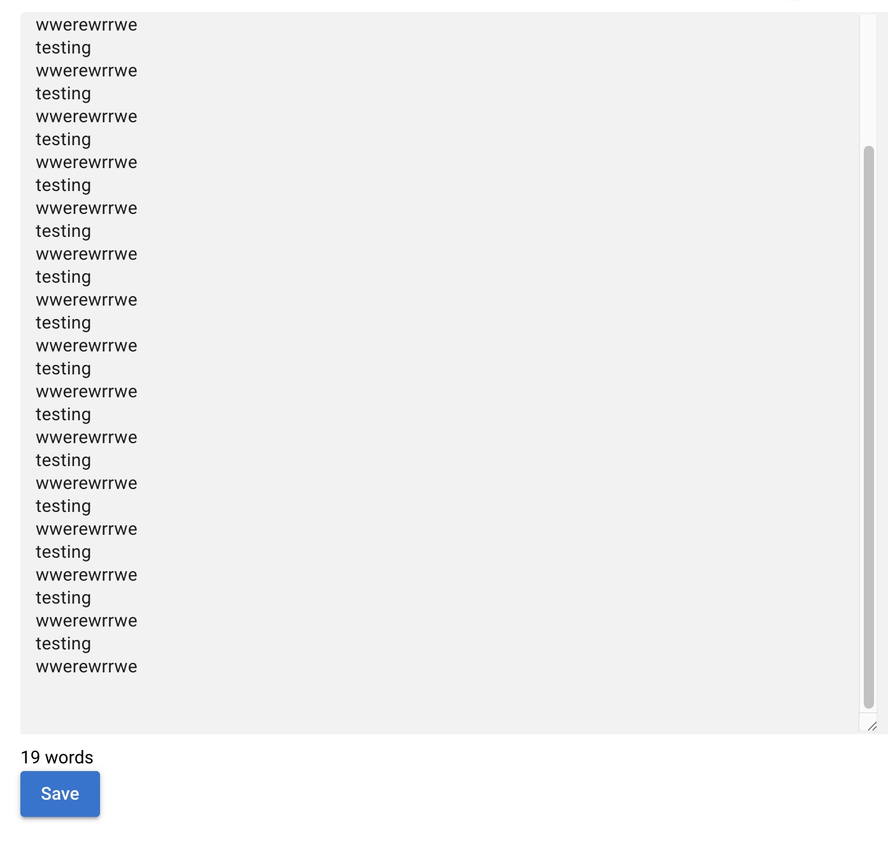

```

```

I am now testing the writing section of the platform

using account simon001 


Should personality test results be used in the hiring process?

**Situation:**

After the reading and listening tasks, you are asked to compile a report focusing on the disadvantages of using personality test results in job applications. You will listen to the full podcast. Make notes as you listen. You now have one minute to familiarize yourself with the task requirement before the recording.

Read the following topic: Should personality test results be used in the hiring process? Write a total of 250 words in TWO paragraphs to argue AGAINST the above topic. You are required to make use of information or examples found in BOTH the reading passage and the podcast to support your reasoning. Using online sources to assist with your writing is NOT permitted.

Write TWO disadvantages of using personality test results in the hiring process for each paragraph from the perspective of the following stakeholders. Do NOT write an introduction.

After the label situation- we should have another label such as Instructions 

 After the reading and listening tasks, you are asked to compile a report focusing on the disadvantages of using personality test results in job applications. You will listen to the full podcast. Make notes as you listen. You now have one minute to familiarize yourself with the task requirement before the recording.

(we should inform the candidates how long is the full podcast) 


You will be graded on the following criteria:

* Content (5 marks)
  * address the topic / question with ideas from BOTH sources
  * support ideas with relevant elaboration from BOTH sources
* Language (5 marks)
  * demonstrate an effort in rephrasing source ideas
  * use a range of grammatical structures and vocabulary items accurately
* Organization (5 marks)
  * demonstrate clear and logical links between ideas
  * structure paragraphs using effective cohesive devices

it is a bit unusual to provide detailed rubrics - we should write a note on this for the exam writing team (Rhett)




overall instructions page is a bit plain and clusttered

we should consider adding more instructions on the right 

we should format it in a more professional way 

the audio player at the bottom - should be placed in a more promiment place 




the writing space can be shorter (shorter height)- currently the word count and save button cannot be seen without scrolling down
